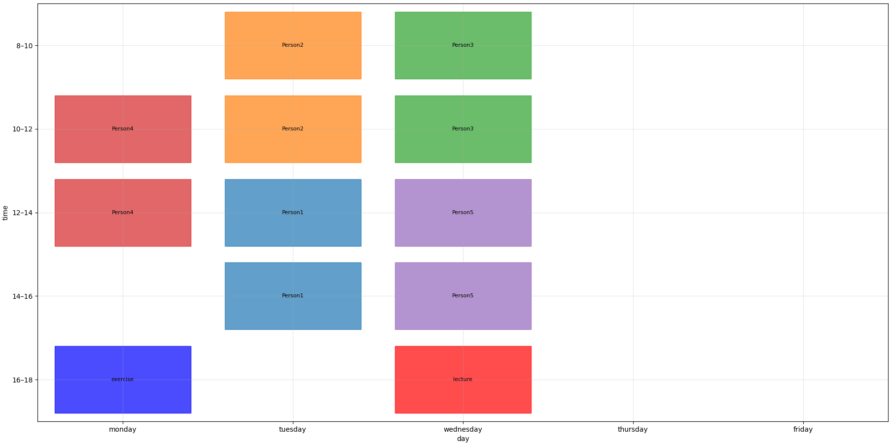

# Tutorial Planning Optimizer



An optimization tool for scheduling tutorial sessions based on tutor availability and preferences, maximizing overall utility while ensuring fairness across all tutors.

## Core Features

- **Utility Maximization**: Assigns tutors to time slots by maximizing a weighted preference score (wish slots > alternative slots), with a fairness term that lifts the minimum utility across all tutors.
- **Connectivity Bonus**: Rewards consecutive slot assignments for tutors who prefer uninterrupted blocks.
- **Constraint Satisfaction**: Enforces hard constraints — no double-booking, fixed lecture/exercise slots remain free, and blocked slots are strictly excluded.
- **Conflict Detection**: Automatically flags input data inconsistencies (overlapping wish/block slots) before solving.

## Technical Stack

- **Language**: Python 3.14.3
- **Solver**: Gurobi (via `gurobipy`) — requires a valid Gurobi license ([free academic license available](https://www.gurobi.com/academia/academic-program-and-licenses/))
- **Libraries**: Matplotlib (visualization)

## How the Optimizer Works

Each tutor is assigned exactly 2 time slots from a discretized weekly schedule (2-hour blocks, Mon–Fri, 8–18). The optimizer solves a Mixed-Integer Linear Program:

$$U_p = \sum_{s \in \text{wish}} x_{p,s} + 0.5 \sum_{s \in \text{alternative}} x_{p,s} + 2 \sum_{\text{consecutive pairs}} y_{p,d,t}$$

$$\max \sum_p U_p + 10 \cdot U_{\min}$$

where $x_{p,s} \in \{0,1\}$ indicates assignment and $y_{p,d,t}$ captures consecutive slot pairs per day.

## Setup & Installation

1. Clone repository: `git clone https://github.com/GaiusJ/Tutorial-Planning.git`
2. Install dependencies: `pip install -r requirements.txt`
3. Activate Gurobi license: `grbgetkey <your-key>`
4. Run optimizer: `python TutorialPlanning.py`

## Configuration

Edit the `persons` list in `TutorialPlanning.py` to define tutors and their availability:

```python
person("Name",
    wish_slot=[slot("monday", 10, 12)],                 # preferred slots (weight 1)
    alternative_wish_slot=[slot("tuesday", 14, 16)],    # fallback slots (weight 0.5)
    block_slots=[slot("friday", 8, 18)],                # unavailable slots
    connected=True)                                     # prefer consecutive blocks
```

## License & Terms of Use

This is an academic side project.

- **Personal & Educational Use**: Feel free to explore, learn from, and use this tool for private purposes.
- **Commercial Use**: Prohibited. Contact me directly for written permission.